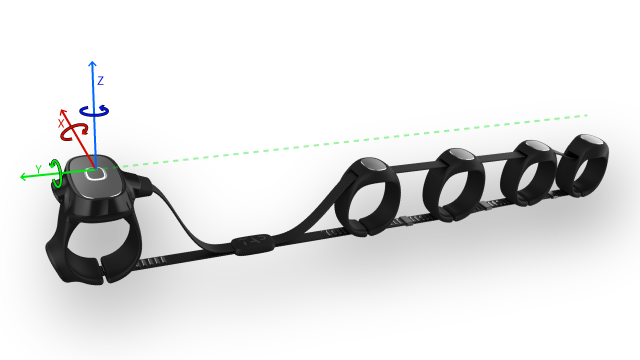

## TapStrap Python SDK (beta)

### What Is This ?

TAP python SDK allows you to build python app that can establish BLE connection with the Tap Strap, send commands and receive events and data - Thus allowing TAP to act as a controller for your app!  
The library is developed with Python >= 3.7 and is **currently in beta**.


### Supported Platforms
This package supports the following platforms:
* MacOS (tested on 10.15.2) - using Apple's CoreBluetooth library. The library depends on PyObjC which Apple includes with their Python version on OSX. Note that if you're using a different Python, be sure to install PyObjC for that version of Python.  
* Windows 10 - by wrapping the dynamic library (DLL) generated by [tap-standalonewin-sdk](https://github.com/TapWithUs/tap-standalonewin-sdk).
* Linux (testerd on Ubuntu 18.04) - need to install libbluetooth-dev and bluez-tools
    ```
    sudo apt-get install bluez-tools libbluetooth-dev
    ```
    also the user needs to be in the bluetooth group:
    ```
    sudo usermod -G bluetooth -a <username>
    #and can reload groups in this shell by running the following command or by logging out and back in:
    su - $USER
    ```


### Installation  
Clone this repo and install the package.
```console
git clone https://github.com/TapWithUs/tap-python-sdk
cd tap-python-sdk
pip install .
```


Then just import the main class
```python
from tapsdk import TapSDK
tap_device = TapSDK()
```
Note that the SDK will not scan for BLE peripherals, therefore you'll have to pair the Tap manually with your machine.

Also make sure that you have updated your tap strap to the latest version.

### Features

This SDK implements two basic interfaces with the Tap Strap.

First is setting the operation mode of the Tap strap:

1. *Text mode* - the strap will operate normally, with no events being sent to the SDK
2. *Controller mode* - the strap will send events to the SDK
3. *Controller and Text mode* - the strap will operate normally, in parallel with sending events to the SDK
4. *Raw data mode* - the strap will stream raw sensors data to the SDK.

Second, subscribing to the following events:

1. *Tap event* - whenever a tap event has occured
2. *Mouse event* - whenever a mouse movement has occured
3. *AirGesture event* - whenever one of the gestures is detected
4. *Raw data* - whenever new raw data sample is being made.

Additional to these functional event, there are also some state events, such as connection and disconnection of Tap straps to the SDK backend.


The SDK uses callbacks to implement user functions on the various events. To register a callback, you just have to instance a TapSDK object and just:

```python
def on_tap_event(self, identifier, tapcode):
    print(identifier + " tapped " + str(tapcode))

tap_device.register_tap_events(on_tap_event)
```
#### Commands list
1. ```set_input_mode(self, mode:TapInputMode, identifier):```
This function send a mode selection command. It accepts an Object of type ```TapInputMode``` initializes with any of the following modes ```["text", "controller", "controller_text", "raw"]```  
For example 
    ```python
    from tapsdk import TapInputMode
    tap_device.set_input_mode(TapInputMode("controller"))
    ```  
    Also, when instantiating a ```TapInputMode``` for raw sensors mode, additional argument ```sensitivity``` (list with 3 integers) is optional for example
    ```python
    tap_device.set_input_mode(TapInputMode("raw", sensitivity=[2,1,4]))
    ```

2. ```send_vibration_sequence(self, sequence:list, identifier):```
This function send a series of haptic activations. ```sequence``` is a list of integers indicating for the activation and delay periods one after another. The periods are in millisecond units, in the range of [10,2550] and in resolution of 10ms. Each haptic command support up to 18 period definitions (i.e. 9 haptics + delay pairs).  
For example, 
    ```python 
        tap_device.send_vibration_sequence(sequence=[1000,300,200])
    ```  
    will trigger a 1s haptic, followed by 300ms delay, followed by 200ms haptic.


#### Events list
1. ```register_connection_events(self, listener:Callable):```  
Resgister callback to a Tap strap connection event.
```python
    def on_connect(identifier, name, fw):
        print(identifier + " - connected. Name: " + str(name), " FW Version: ", fw)

    tap_device.register_connection_events(on_connect)
``` 

2. ```register_disconnection_events(self, listener:Callable):```  
Resgister callback to a Tap strap disconnection event.
    ```python
    def on_disconnect(identifier):
        print(identifier + " - disconnected")

    tap_device.register_disconnection_events(on_disconnect)
    ``` 


3. ```register_tap_events(self, listener:Callable):```  
Resgister callback to a tap event.
    ```python
    def on_tap_event(identifier, tapcode):
        print(identifier + " -  tapped " + str(tapcode))

    tap_device.register_tap_events(on_tap_event)
    ```    
    ```tapcode``` is a 8-bit unsigned number, between 1 and 31 which is formed by a binary  representation of the fingers that are tapped.
    The LSb is thumb finger, the MSb is the pinky finger. 
    For example: if combination equls 5 - it's binary form is 10100 - means that the thumb and the middle fingers were tapped.


4. ```register_mouse_events(self, listener:Callable):```  
Resgister callback to a mouse or air mouse movement event.
    ```python
    def on_mouse_event(identifier, vx, vy, proximity):
        print(identifier + " - moused: %d, %d" %(vx, vy))

    tap_device.register_tap_events(on_tap_event)
    ``` 
    ```vx``` and ```vy``` are the horizontal and vertical velocities of the mouse movement respectively.
    ```proximity``` is a boolean that indicates for proximity with a surface.

5. ```register_raw_data_events(self, listener:Callable):```  
Resgister callback to raw sensors data packet received event.
    ```python
    def on_raw_sensor_data(identifier, raw_sensor_data):
        print(identifier + " - raw data received: " + str(raw_sensor_data))

    tap_device.register_raw_data_events(on_raw_sensor_data)
    ``` 
    You'll find more information on that mode in the dedicated section below or [here](https://tapwithus.atlassian.net/wiki/spaces/TD/pages/792002574/Tap+Strap+Raw+Sensors+Mode).

6. ```register_air_gesture_events(self, listener:Callable):```  
Resgister callback to air gesture events.
    ```python
    from tapsdk.models import AirGestures

    def on_airgesture(identifier, gesture):
        print(identifier + " - gesture: " + str(AirGestures(gesture)))

    tap_device.register_air_gesture_events(on_airgesture)
    ``` 
    ```gesture``` is an integer code of the air gesture detected. The air gesture values are enumerated in the ```AirGestures``` class.

7. ```register_air_gesture_state_events(self, listener:Callable):```  
Resgister callback to events air gesture entarnce/exit.
    ```python
    def on_airgesture_state_change(identifier, in_airgesture_state):
        print(identifier + " - gesture: " + str(in_airgesture_state))

    tap_device.register_air_gesture_state_events(on_airgesture_state_change)
    ``` 
    ```in_airgesture_state``` is a boolean indication to the new state of air gesture.

### Raw sensors mode

**Make sure that "Developer mode" is enabled on TapManager app for this mode to work properly**

In raw sensors mode, the Tap continuously sends raw data from the following sensors:
1. Five 3-axis accelerometers (one per each finger).
    * sampled at 200Hz
    * allows dynamic range configuration (±2G, ±4G, ±8G, ±16G)
2. IMU (3-axis accelerometer + gyro) located on the thumb (**available with TAP Strap 2 only**).
    * sampled at 208Hz. 
    * allows dynamic range configuration for the accelerometer (±2G, ±4G, ±8G, ±16G) and for the gyro (±125dps, ±250dps, ±500dps, ±1000dps, ±2000dps).

The sensors measurements are given with respect to the reference system below.


Each sample (of accelerometer or imu) is preambled wwith a timestamp, referenced to an internal Tap clock.


The dynamic range of the sensors is determined with the ```set_input_mode``` method by passing a ```sensitivity``` integers list of length 3 with the following elements (by order): 
1. Fingers accelerometers sensitivity - 

    | value | sensitivity | scale factor (mg/LSB)|
    | :---: | :---: | :---: | 
    | 0 (default) | ±16G | 31.25 |
    | 1 | ±2G | 3.91 |
    | 2 | ±4G | 7.81 |
    | 3 | ±8G | 15.62 |
    | 4 | ±16G | 31.25 |


2. IMU gyro sensitivity - 
    | value | sensitivity | scale factor (mdps/LSB)|
    | :---: | :---: | :---: |
    | 0 (default) | ±500dps | 17.5 |
    | 1 | ±125dps | 4.375 |
    | 2 | ±250dps | 8.75 |
    | 3 | ±500dps | 17.5 |
    | 4 | ±1000dps | 35 |
    | 5 | ±2000dps | 70 |

3. IMU accelerometer sensitivity -

    | value | sensitivity | scale factor (mg/LSB)|
    | :---: | :---: | :---: | 
    | 0 (default) | ±4G | 0.122 |
    | 1 | ±2G | 0.061 |
    | 2 | ±4G | 0.122 |
    | 3 | ±8G | 0.244 |
    | 4 | ±16G | 0.488 |

### Examples

You can find OS specific examples on the [examples folder](examples).

### Known Issues
An up-to-date list of known issues is available [here](History.md).

### Support

Please refer to the issues tab! :)
