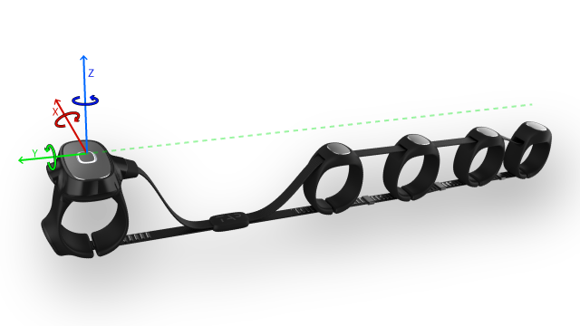
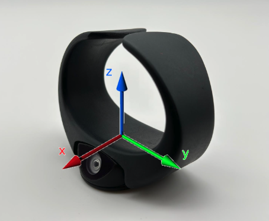

## TapStrap Python SDK (beta)

### What Is This ?

TAP python SDK allows you to build python app that can establish BLE connection with Tap Strap and TapXR, send commands and receive events and data - Thus allowing TAP to act as a controller for your app!  
The library is developed with Python >= 3.9 and is **currently in beta**.


### Supported Platforms
This package supports the following platforms:
* MacOS (tested on 10.15.2) - using Apple's CoreBluetooth library. The library depends on PyObjC which Apple includes with their Python version on OSX. Note that if you're using a different Python, be sure to install PyObjC for that version of Python.  
* Windows 10 - by wrapping the dynamic library (DLL) generated by [tap-standalonewin-sdk](https://github.com/TapWithUs/tap-standalonewin-sdk).
* Linux (tested on Ubuntu 18.04) - need to install libbluetooth-dev and bluez-tools
    ```
    sudo apt-get install bluez-tools libbluetooth-dev
    ```
    also the user needs to be in the bluetooth group:
    ```
    sudo usermod -G bluetooth -a <username>
    #and can reload groups in this shell by running the following command or by logging out and back in:
    su - $USER
    ```


### Installation  
Clone this repo and install the package.
```console
git clone https://github.com/TapWithUs/tap-python-sdk
cd tap-python-sdk
pip install .
```


Then just import the main class
```python
from tapsdk import TapSDK
tap_device = TapSDK()
```
Note that the SDK will not scan for BLE peripherals, therefore you'll have to pair the Tap device manually with your machine.

Also make sure that you have updated your Tap device to the latest version.

### Features

This SDK implements two basic interfaces with a Tap device.

First is setting the operation mode:

1. *Text mode* - the Tap device will operate normally, with no events being sent to the SDK
2. *Controller mode* - the Tap device will send events to the SDK
3. *Controller and Text mode* - the Tap device will operate normally, in parallel with sending events to the SDK
4. *Raw data mode* - the Tap device will stream raw sensors data to the SDK.

Second, subscribing to the following events:

1. *Tap event* - whenever a tap event has occurred
2. *Mouse event* - whenever a mouse movement has occurred
3. *AirGesture event* - whenever one of the gestures is detected
4. *Raw data* - whenever new raw data sample is being made.

Additional to these functional events, there are also some state events, such as connection and disconnection of Tap devices to the SDK backend.

#### Spatial Control - NEW
Authorized developers can gain access to the experimental Spatial Control features:
1. Extended AirGesture state - enabling aggregation for pinch, drag and swipe gestures.
2. Select input type - enabling the selection of input type to be activated - i.e. AirMouse/Tapping. 

These features are only available on TapXR and only for qualified developers. Request access [here](https://www.tapwithus.com/contact-us/)


### High level API
The SDK uses callbacks to implement user functions on the various events. To register a callback, you just have to instance a TapSDK object and:

```python
def on_tap_event(identifier, tapcode):
    print(identifier + " tapped " + str(tapcode))

tap_device.register_tap_events(on_tap_event)
```
#### Commands list
1. ```set_input_mode(self, input_mode:InputMode, identifier=None):```
This function sends a mode selection command. It accepts an object of type ```InputMode``` such as ```InputModeText```, ```InputModeController```, ```InputModeControllerText```, or ```InputModeRaw```.  
For example:
    ```python
    from tapsdk import InputModeController
    await tap_device.set_input_mode(InputModeController())
    ```  
    For raw sensors mode, you can specify sensitivity and scaling:
    ```python
    from tapsdk import InputModeRaw
    from tapsdk.enumerations import FingerAcclSensitivity, ImuGyroSensitivity, ImuAcclSensitivity
    await tap_device.set_input_mode(InputModeRaw(
        scaled=True,
        finger_accl_sensitivity=FingerAcclSensitivity.G4,
        imu_gyro_sensitivity=ImuGyroSensitivity.G250,
        imu_accl_sensitivity=ImuAcclSensitivity.G4
    ))
    ```
2. ```set_input_type(self, input_type:InputType, identifier=None):```   
    > **Only for TapXR and with Spatial Control experimental firmware**

    This function sends a command to force input type. It accepts an enum of type ```InputType``` initialized with any of the types ```InputType.MOUSE```, ```InputType.KEYBOARD```, or ```InputType.AUTO```.  
    For example:
    ```python
    from tapsdk import InputType
    await tap_device.set_input_type(InputType.AUTO)
    ```  
    This will set the input to be automatically selected by the Tap device, based on hand posture.

3. ```send_vibration_sequence(self, sequence:list, identifier=None):```
This function sends a series of haptic activations. ```sequence``` is a list of integers indicating the activation and delay periods one after another. The periods are in millisecond units, in the range of [10,2550] and in resolution of 10ms. Each haptic command supports up to 18 period definitions (i.e. 9 haptics + delay pairs).  
For example: 
    ```python 
    await tap_device.send_vibration_sequence(sequence=[1000,300,200])
    ```  
    will trigger a 1s haptic, followed by 300ms delay, followed by 200ms haptic.


#### Events list
1. ```register_connection_events(self, listener:Callable):```  
Register callback to a Tap strap connection event.
    ```python
    def on_connect(tap_sdk_instance):
        print("Connected to Tap device")

    tap_device.register_connection_events(on_connect)
    ``` 

2. ```register_disconnection_events(self, listener:Callable):```  
Register callback to a Tap strap disconnection event.
    ```python
    def on_disconnect(client):
        print("Tap device disconnected")

    tap_device.register_disconnection_events(on_disconnect)
    ``` 

3. ```register_tap_events(self, listener:Callable):```  
Register callback to a tap event.
    ```python
    def on_tap_event(identifier, tapcode):
        print(identifier + " - tapped " + str(tapcode))

    tap_device.register_tap_events(on_tap_event)
    ```    
    ```tapcode``` is an 8-bit unsigned number, between 1 and 31 which is formed by a binary representation of the fingers that are tapped.
The LSb is thumb finger, the MSb is the pinky finger. 
For example: if combination equals 5 - its binary form is 10100 - means that the thumb and the middle fingers were tapped.


4. ```register_mouse_events(self, listener:Callable):```  
Register callback to a mouse or air mouse movement event.
    ```python
    def on_mouse_event(identifier, vx, vy, proximity):
        print(identifier + " - moused: %d, %d" %(vx, vy))

    tap_device.register_mouse_events(on_mouse_event)
    ``` 
    ```vx``` and ```vy``` are the horizontal and vertical velocities of the mouse movement respectively.
```proximity``` is a boolean that indicates proximity with a surface.
5. ```register_raw_data_events(self, listener:Callable):```  
Register callback to raw sensors data packet received event.
    ```python
    def on_raw_sensor_data(identifier, raw_sensor_data):
        print(identifier + " - raw data received: " + str(raw_sensor_data))

    tap_device.register_raw_data_events(on_raw_sensor_data)
    ``` 
    You'll find more information on that mode in the dedicated section below or [here](https://tapwithus.atlassian.net/wiki/spaces/TD/pages/792002574/Tap+Strap+Raw+Sensors+Mode).

6. ```register_air_gesture_events(self, listener:Callable):```  
Register callback to air gesture events.
    ```python
    from tapsdk import AirGestures

    def on_airgesture(identifier, gesture):
        print(identifier + " - gesture: " + str(AirGestures(gesture)))

    tap_device.register_air_gesture_events(on_airgesture)
    ``` 
    ```gesture``` is an integer code of the air gesture detected. The air gesture values are enumerated in the ```AirGestures``` class.

7. ```register_air_gesture_state_events(self, listener:Callable):```  
Register callback to events air gesture entrance/exit.
    ```python
    def on_airgesture_state_change(identifier, in_airgesture_state):
        print(identifier + " - gesture: " + str(in_airgesture_state))

    tap_device.register_air_gesture_state_events(on_airgesture_state_change)
    ``` 
    ```in_airgesture_state``` is a boolean indication to the new state of air gesture.

### Raw sensors mode

**Make sure that "Developer mode" is enabled on TapManager app for this mode to work properly**

In raw sensors mode, the Tap device continuously sends raw data from the following sensors:
1. Five 3-axis accelerometers - one per each finger (**available only on TAP Strap and Tap Strap 2**).
    * sampled at 200Hz
    * allows dynamic range configuration (±2G, ±4G, ±8G, ±16G)
2. IMU (3-axis accelerometer + gyro) located on the thumb (**available on TAP Strap 2 and TapXR**).
    * sampled at 208Hz. 
    * allows dynamic range configuration for the accelerometer (±2G, ±4G, ±8G, ±16G) and for the gyro (±125dps, ±250dps, ±500dps, ±1000dps, ±2000dps).

The sensors measurements are given with respect to the reference system below.




Each sample (of accelerometer or imu) is preambled with a millisecond timestamp, referenced to an internal Tap clock.


The dynamic range of the sensors is determined with the ```set_input_mode``` method by passing an ```InputModeRaw``` instance with the desired sensitivity enums:
```python
from tapsdk import InputModeRaw
from tapsdk.enumerations import FingerAcclSensitivity, ImuGyroSensitivity, ImuAcclSensitivity

await tap_device.set_input_mode(InputModeRaw(
    scaled=True,
    finger_accl_sensitivity=FingerAcclSensitivity.G4,
    imu_gyro_sensitivity=ImuGyroSensitivity.G250,
    imu_accl_sensitivity=ImuAcclSensitivity.G4
))
```
Refer to the enums in [`tapsdk.enumerations`](tapsdk/enumerations.py#L36) for the available sensitivity values.

### Examples

You can find some examples in the [examples folder](examples).

### Testing

To run the tests, first install the development dependencies:

```bash
pip install .[dev]
```

Then run the tests using pytest:

```bash
pytest
```


### Known Issues
An up-to-date list of known issues is available [here](History.md).

### Support

Please refer to the issues tab! :)
