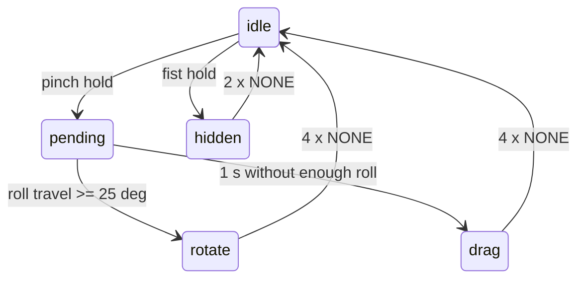

# D-Pad (swipe, pinch, hold to rotate or drag)

**v2 (`TapSDK2`) only.** It needs air gestures and IMU motion. This is the same interaction as the D-Pad page in the TAP_EV sandbox (https://tapwithus.github.io/TAP_EV/).

## Interaction

| User does | Codes | Event |
|-----------|-------|-------|
| Swipe left / right / up / down | 101-104 | `("direction", "left")` ... |
| Short pinch thumb + index / middle / ring / pinky | 105-108 (AB-AE) | `("pinch", 0..3)` (only when nothing is held) |
| Hold a pinch | 110-113 | `("hold", i)`, mode `pending` |
| ...and twist 25° or more within 1 s | IMU roll | `("mode", "rotate")`, then `("rotate", degrees)` |
| ...and do not twist | - | after 1 s `("mode", "drag")`, then `("drag", dx, dy)` |
| Relax the hand | 4 x 100 (NONE) | `("release", i)`: snap back or drop the item |
| Hold a fist | 114 | `("hide",)`; then 2 x NONE gives `("show",)` |

Repeats of the same code within 40 ms are ignored (gesture packets stream continuously).



## Use the template

Copy [scripts/dpad.py](scripts/dpad.py). It has:

- `DpadStateMachine`: pure logic, no Bluetooth. All methods take `now` in seconds (`time.monotonic()`) and return a list of event tuples.
  - `on_gesture(code, now)`: feed air-gesture codes.
  - `on_motion(dx, dy, roll, now)`: feed IMU motion.
  - `tick(now)`: optional; locks drag mode on time if motion packets stop.
  - `held`, `mode`, `hidden`: current state for drawing the UI.
- `main()`: connects, checks v2, enables features, prints events, and buzzes on hold / mode lock / pinch.

Required device setup (after `await sdk.start()`):

```python
await sdk.set_feature(DeviceFeatures.MODEL_DETECTION, True)
await sdk.set_vision_sensor_model(ModelTypes.AIR_GESTURE)
await sdk.set_vision_sensor_op_mode(VisionSensorOpModes.STREAM)
await sdk.set_feature(DeviceFeatures.IMU_MOTION_DATA, True)
```

## Tuning

| Argument | Default | Effect |
|----------|---------|--------|
| `rotate_lock_deg` | 25 | Roll travel needed to choose rotate. Raise it if drag is chosen too rarely. |
| `lock_window_s` | 1.0 | Time to decide between rotate and drag. |
| `release_after` | 4 | `NONE` packets before release. |
| `show_after` | 2 | `NONE` packets after a fist before showing again. |
| `debounce_s` | 0.040 | Ignore repeats of the same code in this window. |

- `drag` deltas are raw device units. Multiply by a gain (TAP_EV uses about 0.45 px per unit) and clamp to the screen.
- `rotate` gives degrees relative to the start of the hold. TAP_EV multiplies by 1.8 for a stronger visual turn.
- If a drag should not stay after release, snap the item back on `("release", i)` (TAP_EV does this).

## Ideas

- Browser game: 4 shapes, each selected by its pinch; hold to rotate or move it. Use the WebSocket bridge from `tap-build-an-app`.
- Menu: swipes move focus in a grid, pinch AB = OK, pinch AC = back, fist = close.
- Photo viewer: swipes = next / previous, hold + twist = rotate, hold + drag = pan.

See also `tap-knob` (hold + twist for values) and `tap-vision-models` (all gesture codes).
