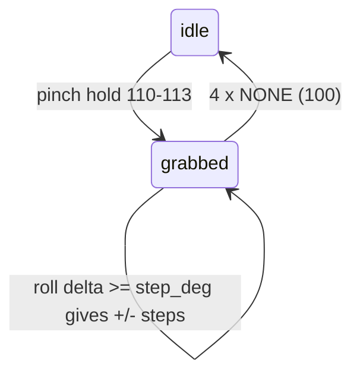

# Knob (pinch-hold + twist)

**v2 (`TapSDK2`) only.** It needs air-gesture holds and IMU roll, which v1 does not provide. This is the same interaction as the Knob in the TAP_EV sandbox (https://tapwithus.github.io/TAP_EV/).

## How it works

1. The user holds a pinch: `AB_HOLD`..`AE_HOLD` (codes 110-113). That **grabs** a knob. Each pinch is a separate knob, so one hand controls 4 values.
2. While the pinch is held, the wrist **roll** from IMU motion turns the knob. The roll at grab time is the reference; every `step_deg` of roll away from it is one step (+ or -).
3. The user relaxes the hand. After `release_after` consecutive `NONE` (100) packets, the knob is **released**. Waiting for several packets stops one noisy packet from dropping the grab.



## Use the template

Copy [scripts/knob.py](scripts/knob.py). It has:

- `KnobTracker`: pure logic, no Bluetooth. Easy to test and reuse.
  - `on_gesture(code)` returns `"start"`, `"release"`, or `None`.
  - `on_roll(roll)` returns signed int steps (0 when idle).
  - `active` is the knob index 0-3 (AB, AC, AD, AE) or `None`.
- `main()`: connects, checks v2, enables the features, and prints 4 values (0-100).

Required device setup (after `await sdk.start()`):

```python
await sdk.set_feature(DeviceFeatures.MODEL_DETECTION, True)
await sdk.set_vision_sensor_model(ModelTypes.AIR_GESTURE)
await sdk.set_vision_sensor_op_mode(VisionSensorOpModes.STREAM)
await sdk.set_feature(DeviceFeatures.IMU_MOTION_DATA, True)
```

Wiring:

```python
def on_air_gesture(identifier, data):
    event = knob.on_gesture(int(data[0]))

def on_motion(identifier, motion):
    _, _, _, (roll, _, _) = motion
    steps = knob.on_roll(roll)
    if steps:
        value[knob.active] += steps
```

## Tuning

| Setting | Default | Effect |
|---------|---------|--------|
| `step_deg` | 1.0 (template uses 2) | Degrees of roll per step. Larger = slower, more precise. 1-2 for fine values, 5-10 for menu items. |
| `release_after` | 4 | `NONE` packets before release. Raise it if the knob drops while still pinching. |

- If the direction feels inverted, use `-steps`.
- Give a short haptic on grab (`send_vibration_sequence([40])`) and optionally a tick every N steps. Do not buzz on every step.
- Clamp values (`max(0, min(100, v))`).
- Roll wraps at +/-180; `wrap_degrees` handles crossing it.

## Ideas

- System volume: map steps to volume up/down keys (`pynput` `Key.media_volume_up`).
- Four properties of one object: AB = size, AC = brightness, AD = opacity, AE = roundness (what the TAP_EV cube sandbox does).
- Scroll a list: one step = one item, with `step_deg = 8`.

See also `tap-dpad` (pinch-hold that chooses between rotate and drag) and `tap-vision-models` (gesture codes).
